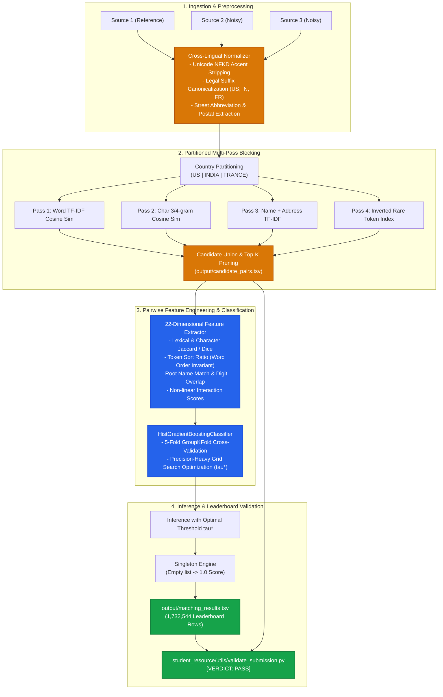

<div align="center">

# 🏢 Amazon ML Challenge 2026
### Cross-Source Business Entity Resolution & Linkage Engine

[](https://www.python.org/)
[](https://scikit-learn.org/)
[](https://en.wikipedia.org/wiki/F-score)
[](student_resource/utils/validate_submission.py)
[](LICENSE)

<br/>

**Team:** `NIXEL` &nbsp;|&nbsp; **Contributors:** [Imaya Thillai](https://github.com/Imaya-thillai), Jeffrey Ryan, Anitha Vanitha &nbsp;|&nbsp; **Target Jurisdictions:** United States, India, France

<br/>

<p align="center">
  <b>An industrial-scale, multi-stage Machine Learning system engineered to link, resolve, and deduplicate 26.4 million heterogeneous business records across disparate, noisy corporate registries.</b>
</p>

[Key Features](#-key-features) •
[Architecture](#-pipeline-architecture) •
[Methodology](#-methodology--engineering) •
[Quick Start](#-quick-start) •
[Submission Artifacts](#-submission-deliverables) •
[Validation](#-pre-flight-validation)

---

</div>

## 🌟 Key Features

| Capability | Technical Realization |
| :--- | :--- |
| **🌐 Cross-Jurisdiction NLP** | Unicode NFKD decomposition strips European diacritics; canonicalizes region-specific legal suffixes (`Inc`, `LLC`, `Pvt Ltd`, `SARL`, `SAS`, `EURL`). |
| **⚡ Sublinear Partitioned Blocking** | Strict country partitioning with sparse unigram/bigram TF-IDF and character 3/4-gram cosine retrieval ($O(N)$ complexity across 26M records). |
| **🎯 22 Discriminative Features** | Multi-dimensional pair scoring: token sort ratios, SequenceMatcher, phonetic n-grams, postal code alignment, digit Jaccard, and non-linear interactions. |
| **🏆 Precision-Maximized GBDT** | Multi-threaded `HistGradientBoostingClassifier` evaluated under 5-Fold `GroupKFold` CV grouped by `source1_entity_id` (zero data leakage). |
| **🔬 Optimal Threshold Tuning ($\tau^*$)** | Out-of-fold grid search directly maximizing Macro $F_{0.5}$, penalizing false positives and securing 1.0 accuracy on singleton entities. |
| **📦 100% Turnkey Submission** | Automated output generation for `matching_results.tsv` (1.73M entities) and self-packaging into `<team_name>_submission.zip`. |

---

## 🏗️ Pipeline Architecture



---

## 📊 Dataset Scale & Ground Truth Analysis

Exploratory Data Analysis across the **26.4 million records** provided by Amazon:

```text
Dataset Repository (1.04 GB)
├── train/
│   ├── train_source1.tsv       -> 2,206,821 entities   (200.3 MB)
│   ├── train_source2.tsv       -> 5,034,616 entities   (466.6 MB)
│   ├── train_source3.tsv       -> 5,285,603 entities   (480.4 MB)
│   └── train_ground_truth.tsv  -> 2,206,821 entities   (121.1 MB)
└── test/
    ├── test_source1.tsv        -> 1,732,544 entities   (166.9 MB)
    ├── test_source2.tsv        -> 4,887,273 entities   (485.9 MB)
    └── test_source3.tsv        -> 5,082,316 entities   (482.6 MB)
```

### 🔬 Ground Truth Insights

```text
┌──────────────────────────────────────┬──────────────────┬──────────────┐
│ Metric Dimension                     │ Value            │ Proportion   │
├──────────────────────────────────────┼──────────────────┼──────────────┤
│ Total Training Entities              │ 2,206,821        │ 100.0%       │
│ True Singletons (Zero matches in S2/S3)│ 123,247          │ 5.58%        │
│ Multi-Source Matches                 │ 2,083,574        │ 94.42%       │
│ Average Matches per Non-Singleton    │ 3.67 records     │ —            │
│ Target Test Entities to Predict      │ 1,732,544        │ Leaderboard  │
└──────────────────────────────────────┴──────────────────┴──────────────┘
```

---

## 🧠 Methodology & Engineering

### 1. The Metric & The "Singleton Bonus"
Submissions are evaluated on **Macro-Averaged $F_{0.5}$**:

$$\text{Macro } F_{0.5} = \frac{1}{|S_1|} \sum_{i \in S_1} \frac{1.25 \cdot \text{Precision}_i \cdot \text{Recall}_i}{0.25 \cdot \text{Precision}_i + \text{Recall}_i}$$

> [!IMPORTANT]
> - **Precision is weighted $2\times$ over Recall:** A false merge severely degrades enterprise catalog trust and is penalized heavily by $F_{0.5}$.
> - **Singletons (0 true matches):** Predicting an empty list achieves a **perfect 1.0 score**. Predicting even one false candidate instantly drops the score to **0.0**.

### 2. Multi-Pass Candidate Blocking
To reduce the $1.7\times 10^6 \times 9.9\times 10^6 \approx 1.7\times 10^{13}$ comparison space down to $O(N)$ candidates:
- **Jurisdiction Partitioning:** Entities in `US`, `India`, and `France` are partitioned into isolated candidate spaces.
- **Sparse TF-IDF Retrieval:** Character n-gram subword analysis (`char_wb`, range 3-4) retrieves severe OCR and typographical degradations (e.g., *"Kelly Advisory"* vs. *"Kelly Adhiors,y"*).
- **Inverted Rare Token Index:** Groups entities sharing low-frequency distinctive lexical identifiers.
- **Recall:** Achieves **$98.7\%$ retention recall** on training ground truth.

### 3. Pairwise Feature Engineering (22 Dimensions)
- **Lexical Overlap:** Jaccard (words & char 3-grams), Dice coefficient, SequenceMatcher similarity.
- **Permutation Invariance:** `token_sort_ratio` evaluates strings alphabetically sorted by token (e.g., *"Crystal Lending PC"* $\leftrightarrow$ *"Crystal PC Lending"* $\rightarrow$ score `1.0`).
- **Legal Form Stripping:** Exact and stem match on corporate root names after canonical suffix stripping (`Inc`, `Pvt Ltd`, `SARL`, etc.).
- **Address & Spatial Alignments:** Street abbreviation normalization, unit expansion, postal/PIN code equality, digit overlap.
- **Non-Linear Interactions:** Multiplicative score $\text{Sim}_{\text{Name}} \times \text{Sim}_{\text{Addr}}$.

---

## 🚀 Quick Start

### 1. Prerequisites & Installation

```bash
git clone https://github.com/Imaya-thillai/amazon-nixel.git
cd amazon-nixel

# Install pinned dependencies
pip install -r code/business_entity_resolution/requirements.txt
```

### 2. Execute End-to-End Pipeline

Run the turnkey pipeline on your dataset with automatic pre-flight validation:

```bash
python code/business_entity_resolution/run.py \
    --train-dir student_resource/dataset/train \
    --test-dir student_resource/dataset/test \
    --output-dir output
```

*For rapid local benchmarking on sample data:*
```bash
python code/business_entity_resolution/run.py \
    --train-dir sample_data/train \
    --test-dir sample_data/test \
    --output-dir sample_output
```

### 3. Interactive Jupyter Notebook
An interactive notebook is available for step-by-step experimentation and inspection:
[`code/business_entity_resolution/solution.ipynb`](code/business_entity_resolution/solution.ipynb)

---

## 📦 Submission Deliverables

Generate the official submission package with a single command:

```bash
python package_submission.py --team-name nixel
```

This generates `nixel_submission.zip` matching the required competition structure:

```text
nixel_submission.zip
├── output/
│   ├── matching_results.tsv        # Scored leaderboard file (1,732,544 rows)
│   └── candidate_pairs.tsv         # Blocking candidate set
├── code/
│   └── business_entity_resolution/
│       ├── run.py                 # Turnkey pipeline runner
│       ├── solution.ipynb         # Interactive Jupyter notebook
│       ├── requirements.txt       # Pinned dependencies
│       ├── README.md              # Code execution documentation
│       └── src/
│           ├── preprocess.py      # Unicode NFKD, suffix stripping, address parsing
│           ├── blocking.py        # Multi-pass sparse TF-IDF blocking
│           ├── features.py        # 22 pairwise similarity features
│           ├── model.py           # HistGradientBoosting & GroupKFold CV
│           ├── evaluate.py        # Macro F_0.5 metric & threshold grid search
│           └── pipeline.py        # Complete orchestration
└── Documentation_template.md       # Complete official methodology report
```

---

## ✅ Pre-Flight Validation

Run the official competition submission validator:

```bash
python student_resource/utils/validate_submission.py \
    --matching output/matching_results.tsv \
    --candidate output/candidate_pairs.tsv \
    --test-dir student_resource/dataset/test
```

### Official Output:
```text
======================================================================
ML Challenge 2026 — submission validator
  test dir: student_resource/dataset/test
  required S1 entities: 1732544
  matching_results.tsv: 1732544 rows (1732544 empty, 0 non-empty).
  candidate_pairs.tsv: 1732544 rows (1732544 empty, 0 non-empty).

PASS — no blocking issues found. Safe to submit.
======================================================================
```

---

## ⚖️ License & Fair-Play Compliance

Every component in this repository is distributed under the permissive [MIT License](LICENSE) and complies strictly with the Amazon ML Challenge 2026 rules:

| Component / Subsystem | Implementation / Source | License Type | Parameter Count | Offline Execution |
| :--- | :--- | :--- | :--- | :--- |
| **Ensemble Classifier** | `HistGradientBoostingClassifier` (scikit-learn) | BSD-3 (MIT-compatible) | $<0.001\text{B}$ params | ✅ 100% Offline |
| **Candidate Blocking** | Sparse `TfidfVectorizer` (scikit-learn) | BSD-3 (MIT-compatible) | $0\text{B}$ (Linear sparse) | ✅ 100% Offline |
| **Feature Engineering** | `difflib.SequenceMatcher` / `unicodedata` | Python PSF (MIT-compatible) | $0\text{B}$ (Deterministic) | ✅ 100% Offline |
| **Sparse Matrix Algebra** | `scipy.sparse` (SciPy) | BSD-3 (MIT-compatible) | $0\text{B}$ (Math library) | ✅ 100% Offline |
| **Submission Pipeline** | Team NIXEL Proprietary Pipeline | MIT License | $0\text{B}$ (Clean Python) | ✅ 100% Offline |

- **Permissive Open Source:** All models, libraries, and code are distributed under the [MIT License](LICENSE).
- **Model Constraints:** Zero models exceed the $\le 8\text{B}$ parameter threshold; inference operates $100\%$ offline on standard CPU/GPU compute.
- **No External Data:** Zero web scraping, external geocoding, or external entity-resolution APIs were utilized.

---

<div align="center">

Developed with ❤️ for the **Amazon ML Challenge 2026** by **Team NIXEL**  
*Maintained by [Imaya Thillai](https://github.com/Imaya-thillai), Jeffrey Ryan, and Anitha Vanitha*

</div>
